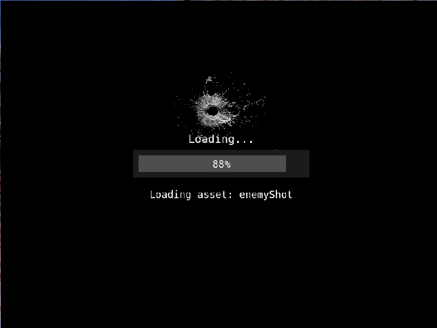
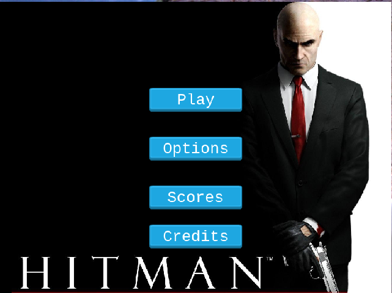
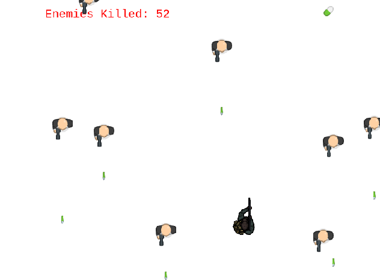
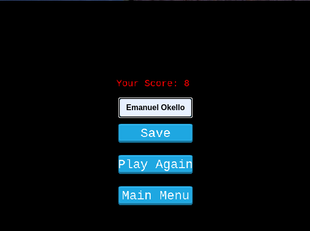

# 24 Bullets

> A shooter game built with Phaser 3 inspired by the 3D Game Hitman 2 the Silent Assasain. 

## Initialization Screen

## Title Screen

## Game Play Screen

## Game Over Screen

## Built With

- HTML5 & ES6 JavaScript
- Phaser 3
- Webpack 

## Live Demo

Play the live demo [here](http://emanuel-okello.me/24-bullets/)!!

## Getting Started

To get a local copy up and running follow these simple example steps.

### Setup and Install

- Clone this repository using the link above (click on the 'code' button)
- Open a terminal and `cd` to the cloned repository
- Once you're in the root (the outer most) directory of the project, run `yarn` to install dependencies.
- Run `yarn run start` to start a server in development (this will open a new tab in your default browser) 
- If the browser did not open after starting the server, open your preferred browser and go to `http://localhost:8080/`

### Tests

- Open `yarn run test` to run the tests

### Usage

#### Play
- To play the game, click on the "Play" button
- Use the 4 Arrow Keys to navigate in the left, right, up and down direction
- Press S key to fire your Gun at the invading enemies
- Dough bullets from the enemies and avoid contact with them.
- You have 4 lives from enemy bullets as indicated at the start on the upper right corner.
- You have only one life in case you collide with an enemy.

#### Save your score
- When the game is over, you can choose between saving your score or going back to the main menu or play again.
- If you choose "Save", you can check from the Title menu if you made it to the top 5.

## Game Design (GDD)

### Main goal

> To develop a top down shooter game in which the shooter eliminates hit-men as they approach him, in the process collecting as many points as possible thus competing to be among the top 5 players. 

### The original idea

> What's the story behind hitman?

My father was an Army general back in the days. As a young boy, he always bought me toy soldiers, and at 14, when I watched the hitman movie in 2007, I fell in live with it.
I decided to develop this game for my nephew as a cheap alternative to 3D games on the console while at the same time improving upon my JavaScript Skill and knowledge using in a fun interactive way.

### Gather and prepare the assets

I made a list of all the assets I would require:
- A background and logo images
- A tile to use as platform
- Images for the player, bullets and enemies
- A hitman sound track plus gun shots, and falling bullet shells.
- Buttons and checkboxes

I looked for assets in open source art websites, such as [OpenGameArt.org](https://opengameart.org/)

### Development stage

#### 1. Set the Required Scenes and Assets

I first added most of the required game assets. 
Since the game requires different scenes for eloquent organization and reusability, I set up the Boot, Preloader, Game, Title, Credit, and Option Scenes.

#### 2. Add the player

First, I designed the player, gave him the right size and physic mechanics like movement.
I then added firing of the bullets.

#### 3. Add Enemies

- Added enemies in form of hitmen and spawned them down the game scene.
- Added the ability of the enemies to fire bullets as well.

#### 4. Add Collision impact

- Added shooter bullet and enemy collision.
- Added shooter bullet and enemy bullet collision.
- Added shooter and enemy bullet collision.
- Added shooter and enemy collision.
All of which either leads to the shooter dying or the enemies.

#### 5. Implement a scoring system

Used the external API to get and post scores by players. 

#### 6. Manuel Testing
Played the game with my nephew. Then changed the game soundtrack plus shooting sounds to make it feel more like a hitman game.

#### 7. Unit Testing
Used Jest to test the External API plus the DOM manipulation.

### Deployment

- Deployed on gh-pages.

## Contirbutor

👤 **Emanuel Okello**

- GitHub: [oxenprogrammer](https://github.com/oxenprogrammer)
- Twitter: [@ox_emmy](https://twitter.com/ox_emmy)
- LinkedIn: [Emanuel Okello](https://www.linkedin.com/in/emanuel-okello/)

## 🤝 Contributing

Contributions, issues and feature requests are welcome!

Feel free to check the [issues page](https://github.com/oxenprogrammer/24-bullets/issues).

## Show your support

Give a ⭐️ if you like this project!

## Attribution
- Sound Track: Hitman by Kevin MacLeod
- Game Assets: FOSS
- Microverse for Project Guidelines.

## 📝 License

This project is [MIT](LICENSE) licensed.